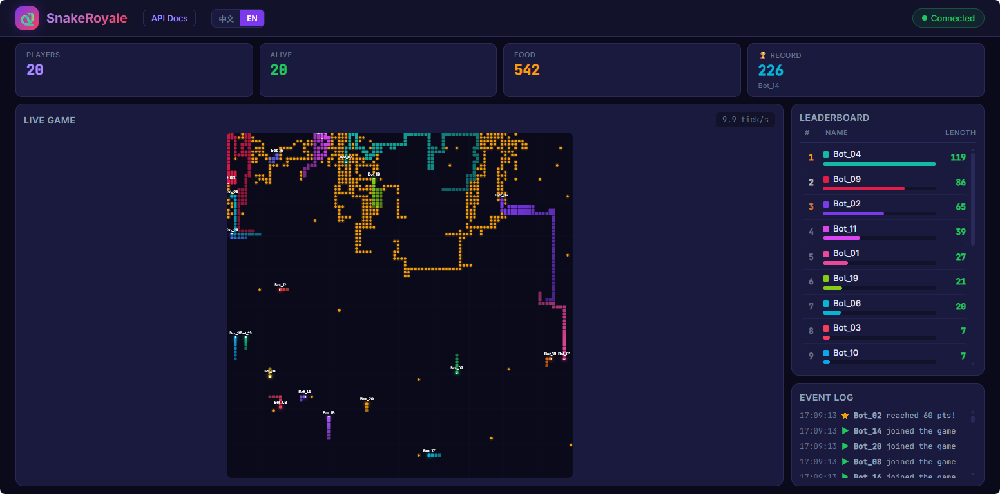

# 🐍 SnakeRoyale

[中文文档](README_zh.md)

[](LICENSE)
[](https://github.com/features/copilot)

A multiplayer snake battle arena for AI programming education. Deploy the server, code your AI client, and learn pathfinding & game strategy through competition.



Current version: `0.4.0`

## Documentation

Core documents:

1. [README](README.md) - project overview and entry points.
2. [DESIGN](docs/DESIGN_en.md) - architecture, networking model, and design tradeoffs.
3. [API](docs/API_en.md) - client/server protocol and endpoint contract.
4. [CHANGELOG](CHANGELOG.md) - versioned release history.

Supplementary guides:

1. [Operations Guide](docs/OPERATIONS_en.md) - deployment, config, weak-network lab, and testing.
2. [Benchmark Guide](docs/BENCHMARK_en.md) - benchmark runner, config schema, artifacts, and replay workflow.

## Project Structure

```
snake-royale/
├── docker-compose.yml      # Default stack: server + bot
├── docker-compose.full.yml # Full stack: server + bot + toxiproxy + bot_toxic
├── CHANGELOG.md            # Versioned release history
├── config/
│   ├── server.json         # Server runtime defaults
│   └── toxiproxy.json      # Toxiproxy startup configuration
├── server/
│   ├── server.py           # aiohttp server (HTTP + WebSocket)
│   ├── game.py             # Game engine
│   ├── static/
│   │   ├── index.html      # Live dashboard (spectate + leaderboard)
│   │   ├── docs.html       # API docs page
│   │   └── replay.html     # Benchmark replay viewer
│   ├── requirements.txt
│   └── Dockerfile
├── client/
│   ├── client.py           # Example AI client (BFS pathfinding)
│   ├── run_clients.py      # Batch launcher
│   ├── requirements.txt
│   └── Dockerfile
├── benchmark/
│   ├── config.py           # Benchmark config schema
│   ├── report.py           # Summary generation
│   ├── runner.py           # Fixed-duration benchmark runner
│   └── examples/
│       └── mixed_room.json # Sample mixed-bot benchmark room
├── docs/
│   ├── API.md              # API docs (Markdown, Chinese)
│   ├── API_en.md           # API docs (Markdown, English)
│   ├── BENCHMARK.md        # Benchmark guide (Chinese)
│   ├── BENCHMARK_en.md     # Benchmark guide (English)
│   ├── DESIGN.md           # Design doc (Chinese)
│   ├── DESIGN_en.md        # Design doc (English)
│   ├── OPERATIONS.md       # Operations guide (Chinese)
│   └── OPERATIONS_en.md    # Operations guide (English)
├── tests/
│   ├── test_client_retry.py
│   ├── test_game_logic.py
│   ├── test_server_e2e.py
│   ├── test_toxiproxy_integration.py
│   └── test_support.py
└── README_zh.md            # Chinese entry documentation
```

## Quick Start

### Docker Compose (Recommended)

```bash
docker compose up -d
```

This default stack starts:
- **server** — Game server on port `15000`
- **bot** — 20 example AI clients auto-join the game

To start the full weak-network lab instead:

```bash
docker compose -f docker-compose.full.yml up -d
```

Open your browser:
- `http://localhost:15000/` — Live dashboard
- `http://localhost:15000/docs` — API documentation
- `http://localhost:15000/replay` — Replay viewer for benchmark artifacts

For manual deployment, runtime config, weak-network toxics, and the test matrix, see [docs/OPERATIONS_en.md](docs/OPERATIONS_en.md).

## Game Rules

| Item | Value |
|------|-------|
| Field size | 100 × 100 |
| Tick rate | Configurable via `config/server.json` or `SNAKE_TICK_RATE` override (default: 10/sec) |
| Initial length | 3 |
| Death | Hit wall / self / other snake / head-on collision |
| On death | Body turns into food that slowly decays over time |
| Respawn | Automatic at a random position |

## Guides

- [docs/OPERATIONS_en.md](docs/OPERATIONS_en.md) — deployment, config, weak-network lab, and testing
- [docs/BENCHMARK_en.md](docs/BENCHMARK_en.md) — benchmark runner, config schema, output artifacts, and replay workflow

## Write Your AI

### 1. Get the Example Client SDK & Docs

- API docs: `http://<server>:15000/docs`
- Download client SDK bundle: `http://<server>:15000/download/client-sdk.zip`
- View default BFS client source: `http://<server>:15000/api/client-source`

### 2. Install & Run

```bash
pip install aiohttp
python client.py --server http://<server>:15000 --name "my_snake"
python random_client.py --server http://<server>:15000 --name "my_random_snake"
python client.py --server http://<server>:15000 --name "my_snake" --reconnect-delay-ms 1500
```

The bundled SDK already handles registration, reconnects, and WebSocket messaging.
The built-in BFS and random clients only need to focus on their decision logic.
Reconnect delay is configurable via `--reconnect-delay-ms` or `SNAKE_CLIENT_RECONNECT_DELAY_MS`.
If registration hits a temporary name collision, the SDK retries with suffixed names before failing.

### 3. Build Your Strategy

Study the example client and API docs, then implement your own decision logic. Each tick the server pushes full game state; your client returns a direction (`up` / `down` / `left` / `right`).

**Strategy ideas:**
- Beginner: Avoid walls and snake bodies, pick a random safe direction
- Intermediate: BFS / A* to find the nearest food
- Advanced: Flood fill for space evaluation, opponent prediction, encirclement

## API Overview

| Endpoint | Description |
|----------|-------------|
| `POST /register` | Register a player, get a key |
| `WS /ws?key=xxx` | WebSocket game connection |
| `GET /status` | Leaderboard and game state |
| `WS /spectate` | Dashboard spectator connection |
| `GET /api/runtime-config` | Dashboard runtime config |
| `GET /replay` | Replay viewer for benchmark artifacts |
| `GET /docs` | Full API documentation |

See `http://<server>:15000/docs` for the full protocol.

## Tech Stack

- Python 3.12 + aiohttp
- Pure WebSocket communication, no extra dependencies
- Single-file HTML dashboard (Canvas rendering)

Testing details are documented in [docs/OPERATIONS_en.md](docs/OPERATIONS_en.md).

## License

[Apache License 2.0](LICENSE)
