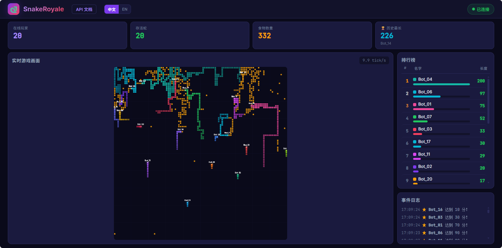

# 🐍 SnakeRoyale · 蛇蛇大逃杀

[English](README.md)

[](LICENSE)
[](https://github.com/features/copilot)

多人在线贪吃蛇对战平台，适用于 AI 编程教学与算法实践。部署服务器，编写 AI 客户端，在对战中学习路径规划、博弈策略等算法。



当前版本：`0.2.0`

## 文档总览

从 `0.2.0` 开始，项目文档固定为四个部分：

1. [README](README_zh.md) - 项目介绍、部署方式、运行方式和测试入口。
2. [DESIGN](docs/DESIGN.md) - 架构设计、网络模型和关键取舍。
3. [API](docs/API.md) - 客户端与服务端接口契约。
4. [CHANGELOG](CHANGELOG.md) - 版本演进记录。

## 项目结构

```
snake-royale/
├── docker-compose.yml      # 一键拉起服务
├── CHANGELOG.md            # 版本变更记录
├── server/
│   ├── server.py           # aiohttp 服务器 (HTTP + WebSocket)
│   ├── game.py             # 游戏引擎
│   ├── static/
│   │   ├── index.html      # 实时 Dashboard (观战 + 排行榜)
│   │   └── docs.html       # API 文档页
│   ├── requirements.txt
│   └── Dockerfile
├── client/
│   ├── client.py           # 示例 AI 客户端 (BFS 寻路)
│   ├── run_clients.py      # 批量启动脚本
│   ├── requirements.txt
│   └── Dockerfile
├── docs/
│   ├── API.md              # API 文档 (Markdown, 中文)
│   ├── API_en.md           # API 文档 (Markdown, English)
│   ├── DESIGN.md           # 设计说明（中文）
│   └── DESIGN_en.md        # Design doc (English)
└── README.md               # English entry documentation
```

## 快速开始

### Docker Compose（推荐）

```bash
docker compose up -d
```

如果课堂网络环境一般，建议直接在 `docker-compose.yml` 里调节服务节奏：

```yaml
environment:
    SNAKE_TICK_RATE: "10"
    SNAKE_SEND_TIMEOUT_MS: "80"
    SNAKE_DISCONNECT_GRACE_MS: "3000"
    SNAKE_SPECTATOR_RECONNECT_MS: "2000"
```

启动后：
- **server** — 游戏服务器，监听 `15000` 端口
- **bot** — 20 个示例 AI 客户端自动加入对战

浏览器访问：
- `http://localhost:15000/` — 实时 Dashboard 观战
- `http://localhost:15000/docs` — API 文档

bot 数量可在 `docker-compose.yml` 中修改 `-n` 参数。

### 手动部署

```bash
# 启动服务器
cd server
pip install -r requirements.txt
python server.py

# 启动示例客户端（另开终端）
cd client
pip install -r requirements.txt
python run_clients.py -n 10                # 启动 10 个 AI
python run_clients.py -n 5 --server http://192.168.1.100:15000  # 指定服务器
```

## 游戏规则

| 项目 | 值 |
|------|-----|
| 场地大小 | 100 × 100 |
| Tick 速率 | 可通过 `SNAKE_TICK_RATE` 配置，默认 10 次/秒 |
| 初始长度 | 3 |
| 死亡条件 | 撞墙 / 撞自己 / 撞别人 / 头对头 |
| 死亡机制 | 蛇身变为食物散落原地，随时间缓慢腐烂 |
| 重生 | 死亡后自动在随机位置重生 |

## 服务调优

- `SNAKE_TICK_RATE`：服务端 tick 频率。课堂无线网络或投屏环境卡顿时，优先把这个值往下调。
- `SNAKE_SEND_TIMEOUT_MS`：单次 WebSocket 发送超时。每个连接有独立 sender task，超时只影响该连接自己。
- `SNAKE_DISCONNECT_GRACE_MS`：断线保活窗口。连接断开后，蛇会按最后方向继续运行，在这个时间内用同一个 key 重连可以续上原来的蛇。
- `SNAKE_SPECTATOR_RECONNECT_MS`：Dashboard 观战端断线后的自动重连间隔。
- Dashboard 新增“生存统计”页签，展示每个 bot 的平均存活长度和平均存活时间，比单次历史最长更适合课堂观察。

当前服务端的广播机制已经改成“主 game loop 只产出最新状态，每个客户端/观战端各自异步发送”，所以某个慢连接不会再阻塞其他连接的发送链路。

## 编写你的 AI

### 1. 获取示例客户端 & 文档

- API 文档：`http://<server>:15000/docs`
- 示例客户端下载：`http://<server>:15000/download/client.py`

### 2. 安装依赖 & 运行

```bash
pip install aiohttp
python client.py --server http://<server>:15000 --name "my_snake"
python client.py --server http://<server>:15000 --name "my_snake" --reconnect-delay-ms 1500
```

示例客户端的断线重连间隔也支持配置：
- CLI 参数：`--reconnect-delay-ms`
- 环境变量：`SNAKE_CLIENT_RECONNECT_DELAY_MS`

### 3. 开发自己的 AI

参考示例客户端和 API 文档，实现你自己的决策逻辑。每个 tick 服务器推送完整游戏状态，你的客户端返回一个方向（`up` / `down` / `left` / `right`）。

**策略方向：**
- 入门：避开墙壁和蛇身，随机选安全方向
- 进阶：BFS / A* 寻找最近食物
- 高级：空间评估（flood fill）、预判对手、围杀策略

## API 概览

| 接口 | 说明 |
|------|------|
| `POST /register` | 注册玩家，获取 key |
| `WS /ws?key=xxx` | WebSocket 游戏连接 |
| `GET /status` | 排行榜和游戏状态 |
| `WS /spectate` | Dashboard 观战连接 |
| `GET /api/runtime-config` | Dashboard 运行时配置 |
| `GET /docs` | 完整 API 文档 |

详细协议见 `http://<server>:15000/docs`

## 技术栈

- Python 3.12 + aiohttp
- 纯 WebSocket 通信，无额外依赖
- 单 HTML 文件 Dashboard（Canvas 渲染）

## 测试

```bash
python -m unittest discover -s tests -v
```

测试套件包含两层：
- `tests/test_game_logic.py`：核心游戏逻辑与统计口径
- `tests/test_server_e2e.py`：注册、WebSocket、观战、断线保活、恢复连接等端到端场景

## License

[Apache License 2.0](LICENSE)
